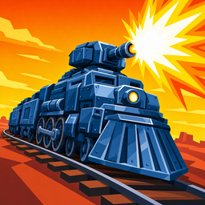

# Ballast: Rail Defense — test builds

An inverted tower-defense game: you arm a train with weapon carts and escort it along the
rails through hostile territory. Android, landscape, touch.

This repo exists only to hand out test builds. The game's source lives in a private repo.

## Download

### 👉 [**Download the latest APK**](https://github.com/fgusztav/ballast-downloads/releases/download/apk-latest/app.apk)

That link always points at the newest build — no need to hunt for a version number.

## Installing it

Android blocks apps that didn't come from the Play Store until you allow it, so the first
install takes one extra tap:

1. Open the download link **on your phone** (not on a desktop).
2. Tap the downloaded `app.apk` — usually via the notification, or in **Files → Downloads**.
3. Android will say something like *"For your security, your phone isn't allowed to install
   unknown apps from this source."* Tap **Settings**, turn on **Allow from this source**, then
   press back and tap **Install** again.
4. You only have to do that once. Later builds install straight over the top — no need to
   uninstall first.

**Requirements:** Android 7.0 or newer. Roughly 60 MB download, a bit more once installed.

## Heads-up

These are **test builds, not a finished game.** Expect rough edges, placeholder balance, and
the occasional bug. They're unsigned test builds, so Google Play Protect may warn you — that's
expected for anything installed outside the Play Store.

Found something broken or confusing? Tell me — that's the whole point of these builds.
